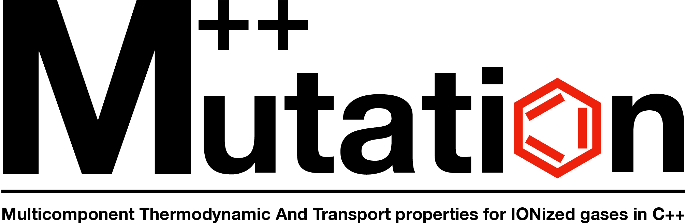

Mutation++ is an open-source library originally developed at the [von Karman Institute for Fluid Dynamics](https://www.vki.ac.be), designed to couple with conventional computational fluid dynamics codes to provide thermodynamic, transport, chemistry, and energy transfer properties associated with subsonic to hypersonic flows.

## Get started
* [See what Mutation++ can do](docs/capabilities.md#top)
* [Introductory tutorial](docs/getting-started.md#top)
* [Going further](docs/Readme.md#top) - full reference section

## More
* Feature requests and bugs can be raised on the [Github issue tracker](https://github.com/mutationpp/Mutationpp/issues)
* Check out [who we are](docs/contributors.md#top)
* Thank [our sponsors](docs/funding.md#top)
* Find [other projects using Mutation++](docs/users.md#top)
